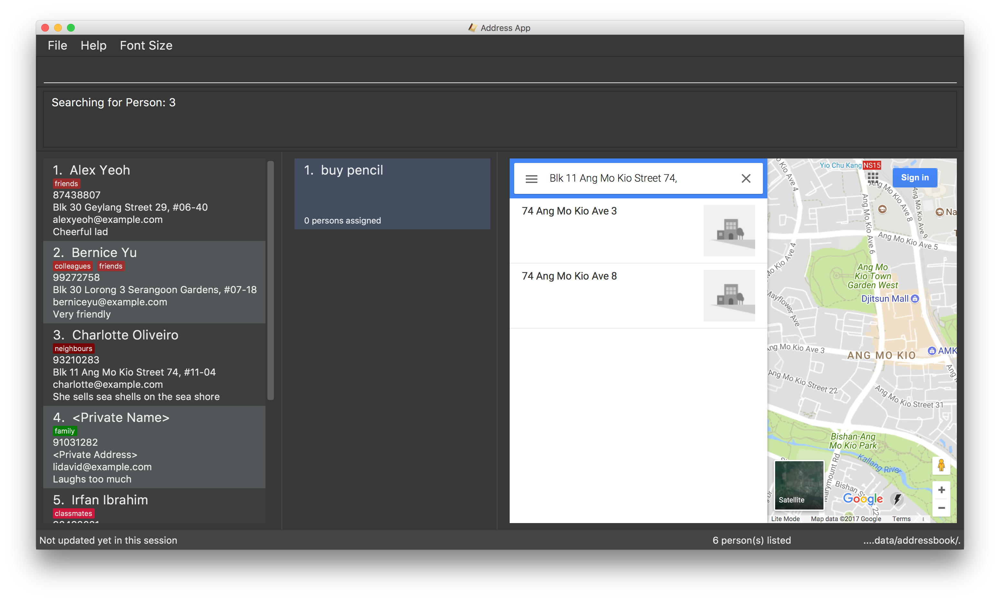

= Address Book (Level 4)
ifdef::env-github,env-browser[:relfileprefix: docs/]
ifdef::env-github,env-browser[:outfilesuffix: .adoc]

https://travis-ci.org/CS2103AUG2017-W09-B2/main[image:https://travis-ci.org/CS2103AUG2017-W09-B2/main.svg?branch=master[Build Status]]
https://ci.appveyor.com/project/jeffreygohkw/addressbook-level4-x6ah4[image:https://ci.appveyor.com/api/projects/status/duqy9ai449wl80n2?svg=true[Build Status]]
https://coveralls.io/github/CS2103AUG2017-W09-B2/main[image:https://coveralls.io/repos/github/CS2103AUG2017-W09-B2/main/badge.svg?branch=master[Coverage Status]]
https://www.codacy.com/app/charlesgoh/main?utm_source=github.com&amp;utm_medium=referral&amp;utm_content=CS2103AUG2017-W09-B2/main&amp;utm_campaign=Badge_Grade[image:https://api.codacy.com/project/badge/Grade/a5878f0b77e34e7eac031ed882cac3cb[Codacy Status]]

ifdef::env-github[]

endif::[]

ifndef::env-github[]
image::images/Ui.png[width="600"]
endif::[]

* This is a desktop Address Book application. It has a GUI but most of the user interactions happen using a CLI (Command Line Interface).
* It is a Java sample application intended for students learning Software Engineering while using Java as the main programming language.
* It is *written in OOP fashion*. It provides a *reasonably well-written* code example that is *significantly bigger* (around 6 KLoC)than what students usually write in beginner-level SE modules.
* What's different from https://github.com/se-edu/addressbook-level3[level 3]:
** A more sophisticated GUI that includes a list  panel and an in-built Browser.
** More test cases, including automated GUI testing.
** Support for _Build Automation_ using Gradle and for _Continuous Integration_ using Travis CI.

== Site Map

* <<UserGuide#, User Guide>>
* <<DeveloperGuide#, Developer Guide>>
* <<AboutUs#, About Us>>
* <<ContactUs#, Contact Us>>

== Acknowledgements

* Some parts of this sample application were inspired by the excellent http://code.makery.ch/library/javafx-8-tutorial/[Java FX tutorial] by
_Marco Jakob_.

== Licence : link:LICENSE[MIT]
